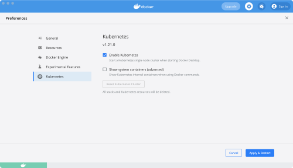
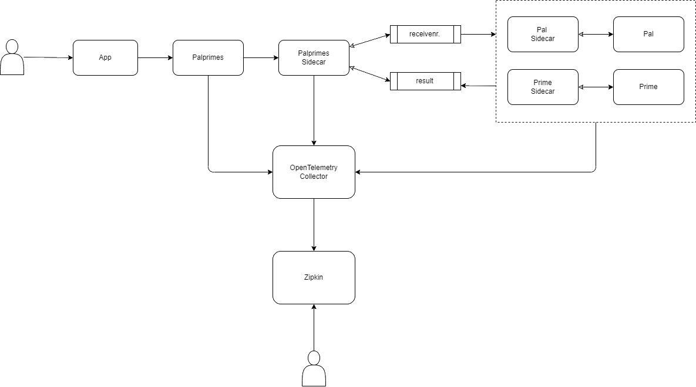
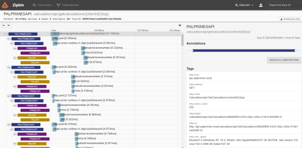

# Dapr

    dapr run --app-id palprimesapi --app-port 5296 --dapr-http-port 3500 dotnet run
    dapr run --app-id palapi --app-port 5221 --dapr-http-port 3510 dotnet run
    dapr run --app-id primespi --app-port 5225 --dapr-http-port 3520 dotnet run

## Tasks

1. Dockerize (DONE)
1. Frontend app,
   1. Blazor
   1. SignalR (DONE)
   1. Angular (DONE)
1. Implementer algorithm's for Prime og Pal (DONE)
1. Fix bug med Prime-api (DONE)
1. Docker-Desktop Kubernetes (DONE) 1. Add SignalR back plane.
1. Get open tracing to work with zipkin on Docker and Kubernetes 1. General info: https://docs.microsoft.com/en-us/dotnet/architecture/dapr-for-net-developers/observability 1. Example with Zipkin exporter: https://github.com/open-telemetry/opentelemetry-dotnet/tree/main/examples/AspNetCore (DONE)
1. Competing consumers - skalering ("consumer.groups in redis") (DONE)
1. Azure Kubernetes

## Run apps on Docker

Run all commands from root folder.

### Compose up

    docker-compose.exe -f .\docker-compose.yml -f .\docker-compose.debug.yml up --build -d

Hit <http://localhost:5220> in your browser to go to angular frontend.

### Compose down

    docker-compose.exe -f .\docker-compose.yml -f .\docker-compose.debug.yml down

## Run Angular app locally

In case you want to run angular frontend outside Docker than start backend in Docker first and run ng serve.

CD to Frontend/Angular/angular-app folder and run the command below.

    ng serve

Hit <http://localhost:4200> in your browser.

## Run apps on Kubernetes

> Before you continue make sure to 1) [Setup Kubernetes and Dapr](#kubernetes) and 2) [Setup Open Telemetry on Kubernetes](#open-telemetry).
> 

### Build & package apps

1.  Run docker compose in case you need new build

        docker-compose.exe -f .\docker-compose.yml up -d --build

1.  Run below commands to create helm package for each app

        helm package --version "0.0.0-latest" --app-version latest --destination ./dist/helm ./src/Frontend/Angular/angular-app/charts
        helm package --version "0.0.0-latest" --app-version latest --destination ./dist/helm ./src/Palprimes.Api/Charts
        helm package --version "0.0.0-latest" --app-version latest --destination ./dist/helm ./src/Pal.Api/Charts
        helm package --version "0.0.0-latest" --app-version latest --destination ./dist/helm ./src/Prime.Api/Charts

1.  Run below commands to deploy all apps

    > In case you want to test the output just uncomment `--dry-run >> ./dist/{appname}.yaml`.

        helm upgrade angularapp -f ./src/Frontend/Angular/angular-app/charts/values.yaml --install --recreate-pods --version=latest -n palprimes --set buildID=latest --set image.tag=latest ./dist/helm/angularapp-0.0.0-latest.tgz # --dry-run >> ./dist/angularapp.yaml

        helm upgrade palprimesapi -f ./src/Palprimes.Api/Charts/values.yaml --install --recreate-pods --version=latest -n palprimes --set buildID=latest --set image.tag=latest --set ASPNETCORE_ENVIRONMENT=Production ./dist/helm/palprimesapi-0.0.0-latest.tgz #--dry-run >> dist/palprimesapi.yaml

        helm upgrade primeapi -f ./src/Prime.Api/Charts/values.yaml --install --recreate-pods --version=latest -n palprimes --set buildID=latest --set image.tag=latest --set ASPNETCORE_ENVIRONMENT=Production ./dist/helm/primeapi-0.0.0-latest.tgz #--dry-run >> dist/primeapi.yaml

        helm upgrade palapi -f ./src/Pal.Api/Charts/values.yaml --install --recreate-pods --version=latest -n palprimes --set buildID=latest --set image.tag=latest --set ASPNETCORE_ENVIRONMENT=Production ./dist/helm/palapi-0.0.0-latest.tgz #--dry-run >> dist/palapi.yaml

### Uninstall apps

        helm uninstall angularapp --namespace palprimes
        helm uninstall palprimesapi --namespace palprimes
        helm uninstall palapi --namespace palprimes
        helm uninstall primeapi --namespace palprimes

## Kubernetes

> Required only the first time.

### Enable Kubernetes on Docker Desktop

### Install Kubernetes Dashboard

Good in case you want visuals of Kubernetes cluster with some basic administration.

1.  Install dashboard

        kubectl apply -f https://raw.githubusercontent.com/kubernetes/dashboard/v2.5.0/aio/deploy/recommended.yaml

1.  Create admin user and role

        kubectl apply -f .\kubernetes\dashboard\admin-user.yaml
        kubectl apply -f .\kubernetes\dashboard\cluster-rolebinding.yaml

1.  Get token for login

        kubectl -n kubernetes-dashboard get secret $(kubectl -n kubernetes-dashboard get sa/admin-user -o jsonpath="{.secrets[0].name}") -o go-template="{{.data.token | base64decode}}"

1.  Copy the token to use it with Dashboard login.
1.  Run command below

        kubectl proxy

1.  Access dashboard at <http://localhost:8001/api/v1/namespaces/kubernetes-dashboard/services/https:kubernetes-dashboard:/proxy/> after running

### Install Ingress Controller (Nginx)

1.  Add repo

        helm repo add ingress-nginx https://kubernetes.github.io/ingress-nginx

1.  Create namespace

        kubectl create namespace ingress-nginx
        kubectl label namespace ingress-nginx cert-manager.io/disable-validation=true

1.  Create admission controller roles

        kubectl apply -f .\kubernetes\ingress\admission-service-account.yaml

1.  Install Nginx Ingress

        helm install ingress-nginx ingress-nginx/ingress-nginx -n ingress-nginx

1.  Wait until nginx containers run

        kubectl get pods -n ingress-nginx
        NAME                                       READY   STATUS    RESTARTS   AGE
        ingress-nginx-controller-cb87575f5-pztmr   1/1     Running   0          74s

### Install Cert-Manager

1.  Add repo

        helm repo add jetstack https://charts.jetstack.io

1.  Create namespace

        kubectl create namespace cert-manager

1.  Install Cert-Manager

        helm install cert-manager jetstack/cert-manager --namespace cert-manager --create-namespace --version v1.3.1 --set installCRDs=true

1.  Wait until cert-manager pods are running

        kubectl get pod -n cert-manager
        NAME                                       READY   STATUS    RESTARTS   AGE
        cert-manager-7998c69865-s9lwk              1/1     Running   0          28s
        cert-manager-cainjector-7b744d56fb-ldgbv   1/1     Running   0          28s
        cert-manager-webhook-97f8b47bc-cr96d       1/1     Running   0          28s

1.  Install lets-encrypt

        kubectl apply -f ./kubernetes/letsencrypt/letsencrypt-staging-clusterissuer.yaml -n cert-manager

1.  Verify creation of lets-encrypt

        kubectl describe clusterissuer letsencrypt-staging -n cert-manager

### Install Dapr

Inspiration taken from her: <https://docs.dapr.io/operations/hosting/kubernetes/kubernetes-deploy/>

> Note Dapr has been installed using helm charts.

1.  Add dapr helm repo

         helm repo add dapr https://dapr.github.io/helm-charts/
         helm repo update

    > Optionally search for newest version `helm search repo dapr --devel --versions`

1.  Install dapr

        helm upgrade --install dapr dapr/dapr --version=1.6 --namespace dapr-system --create-namespace --wait --set global.logAsJson=true

    > Uninstall dapr by running `helm uninstall dapr --namespace dapr-system`

1.  Verify dapr installation

        kubectl get pods --namespace dapr-system

        NAME                                    READY   STATUS    RESTARTS   AGE
        dapr-dashboard-8664d5c45f-4nxpw         1/1     Running   0          2m19s
        dapr-operator-58b9d5fd59-x44mr          1/1     Running   0          2m19s
        dapr-placement-server-0                 1/1     Running   0          2m19s
        dapr-sentry-858fddc4f7-9hp2w            1/1     Running   0          2m19s
        dapr-sidecar-injector-7497b7945-b9g5g   1/1     Running   0          2m19s

1.  Create palprimes namespace

        kubectl create namespace palprimes

### Install Redis & Configure pubsub and statestore

1.  Add bitnami repo

        helm repo add bitnami https://charts.bitnami.com/bitnami
        helm repo update

1.  Install Redis

        helm install redis bitnami/redis --namespace palprimes --set auth.password=gexo1!

1.  Verify Redis installation

        kubectl get pods --namespace palprimes

        NAME               READY   STATUS    RESTARTS   AGE
        redis-master-0     1/1     Running   0          64s
        redis-replicas-0   1/1     Running   0          64s
        redis-replicas-1   0/1     Running   0          22s

    > Uninstall Redis by running `helm uninstall redis --namespace palprimes`

1.  Configure redis pubsub and statestore dapr components

        kubectl apply -f ./kubernetes/components/redis-statestore.yaml
        kubectl apply -f ./kubernetes/components/redis-pubsub.yaml

### Install Kafka & Configure kafka-pubsub dapr component

The guide is inspired by this quick start: <https://strimzi.io/quickstarts/>

1.  Install strimzi Custom Resource Definition (CRD).

        kubectl create -f 'https://strimzi.io/install/latest?namespace=palprimes' -n palprimes

1.  Wait until strimzi pod is created

        kubectl get pods -n palprimes
        NAME                                        READY   STATUS    RESTARTS   AGE
        redis-master-0                              1/1     Running   0          2m35s
        redis-replicas-0                            1/1     Running   0          2m35s
        redis-replicas-1                            1/1     Running   0          107s
        redis-replicas-2                            1/1     Running   0          80s
        strimzi-cluster-operator-587cb79468-g9d5x   1/1     Running   0          89s

1.  Provision the Apache Kafka cluster

        kubectl apply -f https://strimzi.io/examples/latest/kafka/kafka-persistent-single.yaml -n palprimes

1.  Wait while Kubernetes starts the required pods, services and so on:

        kubectl wait kafka/my-cluster --for=condition=Ready --timeout=300s -n palprimes

1.  Create topics

         kubectl create -f ./kubernetes/topics/receivenumber-topic.yaml
         kubectl create -f ./kubernetes/topics/results-topic.yaml

    > You can delete topic by running `kubectl delete -f ./kubernetes/topics/receivenumber-topic.yaml`

1.  Configure Kafka pubsub

        kubectl apply -f ./kubernetes/components/kafka-pubsub.yaml

### Deploy and Configure Zipkin

1.  Create Zipkin Deployment

        kubectl create deployment zipkin --image openzipkin/zipkin --namespace dapr-system

1.  Create a Kubernetes service for the Zipkin pod

        kubectl expose deployment zipkin --type ClusterIP --port 9411 --namespace dapr-system

1.  Deploy Dapr config

         kubectl apply -f ./kubernetes/config/tracing.yaml

#### Access Zipkin 
 
1. Forward zipkin port
        
        kubectl port-forward svc/zipkin 9411:9411 --namespace dapr-system

1. Access it at <http://localhost:9411> 

#### Access Dapr dashboard

1. Run below command 

        dapr dashboard -k

 1. Access Dapr dashboard at <http://localhost:8080>

### DEPRECATED - Install Kubernetes Metrics Server

Inspiration from <https://dev.to/docker/enable-kubernetes-metrics-server-on-docker-desktop-5434>

        kubectl apply -f .\kubernetes\metrics\components.yaml

> Metrics yaml fetched from <https://github.com/kubernetes-sigs/metrics-server/releases>

## Open Telemetry

We are using OpenTelemetry Collector to collect all metrics and telemetry from services and service sidecar pods.

### Open Telemetry Collector

This runs only on Kubernetes.

1. Install collector

        kubectl apply -f ./kubernetes/otel-collector/open-telemetry-collector-generic.yaml

2. Install Dapr component

        kubectl apply -f ./kubernetes/config/otel-collector.yaml

Now if you run Palprimes on Kubernetes, you should see the instrumentation logs in Zipkin.

## How to

### Test Kafka on Docker

1.  Create test topic

        docker exec broker kafka-topics --bootstrap-server broker:9092 --create --topic quickstart

1.  Write messages to the topic

        docker exec --interactive --tty broker kafka-console-producer --bootstrap-server broker:9092 --topic quickstart

    > Write some text in the terminal window (such as `Hello`) and hit Enter.

1.  Start new terminal window and execute command below to read messages from the topic

         docker exec --interactive --tty broker kafka-console-consumer --bootstrap-server broker:9092 --topic quickstart --from-beginning

    > Now you can produce messages in one terminal window and see them consumed in another.

1.  Delete topic by running `docker exec broker kafka-topics --bootstrap-server broker:9092 --delete --topic quickstart`

## Dapr How-to

Display Dapr config in kubernetes

        dapr configurations --kubernetes
