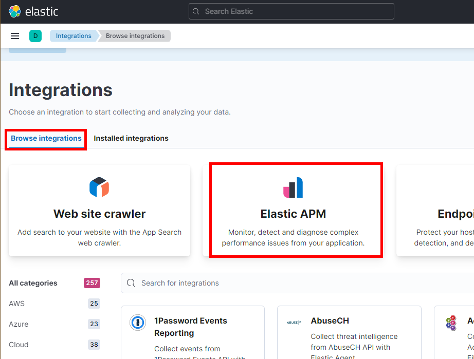
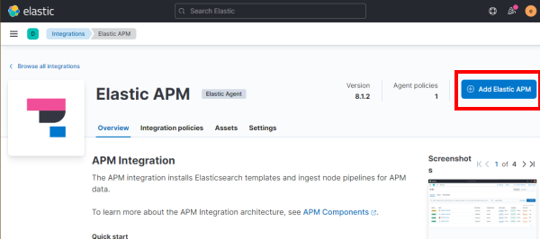
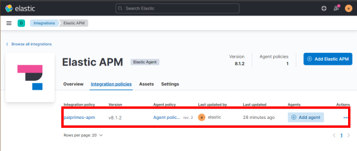

# Dapr

    dapr run --app-id palprimesapi --app-port 5296 --dapr-http-port 3500 dotnet run
    dapr run --app-id palapi --app-port 5221 --dapr-http-port 3510 dotnet run
    dapr run --app-id primespi --app-port 5225 --dapr-http-port 3520 dotnet run

## Tasks

1. Dockerize (DONE)
1. Frontend app,
        1. Blazor
        1. SignalR (DONE)
        1. Angular (DONE)
1. Implementer algorithm's for Prime og Pal (DONE)
1. Fix bug med Prime-api (DONE)
1. Docker-Desktop Kubernetes (DONE) 1. Add SignalR back plane.
1. Get open tracing to work with zipkin on Docker and Kubernetes 1. General info: https://docs.microsoft.com/en-us/dotnet/architecture/dapr-for-net-developers/observability 1. Example with Zipkin exporter: https://github.com/open-telemetry/opentelemetry-dotnet/tree/main/examples/AspNetCore (DONE)
1. Competing consumers - skalering ("consumer.groups in redis") (DONE)
1. Azure Kubernetes
1. Get Opencollector Operator and Sidecar to work: 
        1. https://github.com/open-telemetry/opentelemetry-operator
        1. https://github.com/open-telemetry/opentelemetry-operator
1. Get Open telemetry to work in .net
        1. https://www.meziantou.net/monitoring-a-dotnet-application-using-opentelemetry.htm

## Run apps on Docker

Run all commands from root folder.

### Compose up

    docker-compose.exe -f .\docker-compose.yml -f .\docker-compose.debug.yml up --build -d

Hit <http://localhost:5220> in your browser to go to angular frontend.

### Compose down

    docker-compose.exe -f .\docker-compose.yml -f .\docker-compose.debug.yml down

## Run Angular app locally

In case you want to run angular frontend outside Docker than start backend in Docker first and run ng serve.

CD to Frontend/Angular/angular-app folder and run the command below.

    ng serve

Hit <http://localhost:4200> in your browser.

## Run apps on Kubernetes

> Before you continue make sure to 1) [Setup Kubernetes and Dapr](#kubernetes) and 2) [Setup Open Observability on Kubernetes](#observability).

### Build & package apps

1.  Run docker compose in case you need new build

        docker-compose.exe -f .\docker-compose.yml up -d --build

1.  Run below commands to create helm package for each app

        helm package --version "0.0.0-latest" --app-version latest --destination ./dist/helm ./src/Frontend/Angular/angular-app/charts
        helm package --version "0.0.0-latest" --app-version latest --destination ./dist/helm ./src/Palprimes.Api/Charts
        helm package --version "0.0.0-latest" --app-version latest --destination ./dist/helm ./src/Pal.Api/Charts
        helm package --version "0.0.0-latest" --app-version latest --destination ./dist/helm ./src/Prime.Api/Charts

1.  Run below commands to deploy all apps

    > In case you want to test the output just uncomment `--dry-run >> ./dist/{appname}.yaml`.

        helm upgrade angularapp -f ./src/Frontend/Angular/angular-app/charts/values.yaml --install --version=latest -n palprimes --set buildID=latest --set image.tag=latest ./dist/helm/angularapp-0.0.0-latest.tgz # --dry-run >> ./dist/angularapp.yaml

        helm upgrade palprimesapi -f ./src/Palprimes.Api/Charts/values.yaml --install --version=latest -n palprimes --set buildID=latest --set image.tag=latest --set ASPNETCORE_ENVIRONMENT=Production ./dist/helm/palprimesapi-0.0.0-latest.tgz #--dry-run >> dist/palprimesapi.yaml

        helm upgrade primeapi -f ./src/Prime.Api/Charts/values.yaml --install --version=latest -n palprimes --set buildID=latest --set image.tag=latest --set ASPNETCORE_ENVIRONMENT=Production ./dist/helm/primeapi-0.0.0-latest.tgz #--dry-run >> dist/primeapi.yaml

        helm upgrade palapi -f ./src/Pal.Api/Charts/values.yaml --install --version=latest -n palprimes --set buildID=latest --set image.tag=latest --set ASPNETCORE_ENVIRONMENT=Production ./dist/helm/palapi-0.0.0-latest.tgz #--dry-run >> dist/palapi.yaml

### Uninstall apps

        helm uninstall angularapp --namespace palprimes
        helm uninstall palprimesapi --namespace palprimes
        helm uninstall palapi --namespace palprimes
        helm uninstall primeapi --namespace palprimes

## Kubernetes

> Required only the first time.

### Enable Kubernetes on Docker Desktop


### Install Kubernetes Dashboard

Good in case you want visuals of Kubernetes cluster with some basic administration.

1.  Install dashboard

        kubectl apply -f https://raw.githubusercontent.com/kubernetes/dashboard/v2.5.0/aio/deploy/recommended.yaml

1.  Create admin user and role

        kubectl apply -f .\kubernetes\dashboard\admin-user.yaml
        kubectl apply -f .\kubernetes\dashboard\cluster-rolebinding.yaml

### Install Ingress Controller (Nginx)

1.  Add repo

        helm repo add ingress-nginx https://kubernetes.github.io/ingress-nginx

1.  Install Nginx Ingress

        helm upgrade --install ingress-nginx ingress-nginx --repo https://kubernetes.github.io/ingress-nginx --namespace ingress-nginx --create-namespace --wait

1.  Wait until nginx containers run

        kubectl get pods -n ingress-nginx
        NAME                                       READY   STATUS    RESTARTS   AGE
        ingress-nginx-controller-cb87575f5-pztmr   1/1     Running   0          74s

### Install Cert-Manager

1.  Install Cert-Manager

        helm install cert-manager cert-manager --repo https://charts.jetstack.io --namespace cert-manager --create-namespace --version v1.3.1 --set installCRDs=true

1.  Wait until cert-manager pods are running

        kubectl get pod -n cert-manager
        NAME                                       READY   STATUS    RESTARTS   AGE
        cert-manager-7998c69865-s9lwk              1/1     Running   0          28s
        cert-manager-cainjector-7b744d56fb-ldgbv   1/1     Running   0          28s
        cert-manager-webhook-97f8b47bc-cr96d       1/1     Running   0          28s

1. (DEPRECATED) Install lets-encrypt 

        kubectl apply -f ./kubernetes/letsencrypt/letsencrypt-staging-clusterissuer.yaml -n cert-manager

1. (DEPRECATED) Verify creation of lets-encrypt

        kubectl describe clusterissuer letsencrypt-staging -n cert-manager

### Install Dapr

Inspiration taken from her: <https://docs.dapr.io/operations/hosting/kubernetes/kubernetes-deploy/>

> Note Dapr has been installed using helm charts.

1.  Add dapr helm repo

         helm repo add dapr https://dapr.github.io/helm-charts/
         helm repo update

    > Optionally search for newest version `helm search repo dapr --devel --versions`

1.  Install dapr

        helm upgrade --install dapr dapr/dapr --version=1.7.2 --namespace dapr-system --wait --set global.logAsJson=true --create-namespace

    > Uninstall dapr by running `helm uninstall dapr --namespace dapr-system`

1.  Verify dapr installation

        kubectl get pods --namespace dapr-system

        NAME                                    READY   STATUS    RESTARTS   AGE
        dapr-dashboard-8664d5c45f-4nxpw         1/1     Running   0          2m19s
        dapr-operator-58b9d5fd59-x44mr          1/1     Running   0          2m19s
        dapr-placement-server-0                 1/1     Running   0          2m19s
        dapr-sentry-858fddc4f7-9hp2w            1/1     Running   0          2m19s
        dapr-sidecar-injector-7497b7945-b9g5g   1/1     Running   0          2m19s

1.  Create palprimes namespace

        kubectl create namespace palprimes

### Install Redis & Configure pubsub and statestore

1.  Add bitnami repo

        helm repo add bitnami https://charts.bitnami.com/bitnami
        helm repo update

1.  Install Redis

        helm install redis bitnami/redis --namespace palprimes --set auth.password=gexo1! --create-namespace

1.  Verify Redis installation

        kubectl get pods --namespace palprimes

        NAME               READY   STATUS    RESTARTS   AGE
        redis-master-0     1/1     Running   0          64s
        redis-replicas-0   1/1     Running   0          64s
        redis-replicas-1   0/1     Running   0          22s

    > Uninstall Redis by running `helm uninstall redis --namespace palprimes`

1.  Configure redis pubsub and statestore dapr components

        kubectl apply -f ./kubernetes/components/redis-statestore.yaml
        kubectl apply -f ./kubernetes/components/redis-pubsub.yaml

### Install Kafka & Configure kafka-pubsub dapr component

The guide is inspired by this quick start: <https://strimzi.io/quickstarts/>

1.  Install strimzi Custom Resource Definition (CRD).

        kubectl create -f 'https://strimzi.io/install/latest?namespace=palprimes' -n palprimes

1.  Wait until strimzi pod is created

        kubectl get pods -n palprimes
        NAME                                        READY   STATUS    RESTARTS   AGE
        redis-master-0                              1/1     Running   0          2m35s
        redis-replicas-0                            1/1     Running   0          2m35s
        redis-replicas-1                            1/1     Running   0          107s
        redis-replicas-2                            1/1     Running   0          80s
        strimzi-cluster-operator-587cb79468-g9d5x   1/1     Running   0          89s

1.  Provision the Apache Kafka cluster

        kubectl apply -f https://strimzi.io/examples/latest/kafka/kafka-persistent-single.yaml -n palprimes

1.  Wait while Kubernetes starts the required pods, services and so on:

        kubectl wait kafka/my-cluster --for=condition=Ready --timeout=300s -n palprimes

1.  Create topics

         kubectl create -f ./kubernetes/topics/receivenumber-topic.yaml
         kubectl create -f ./kubernetes/topics/results-topic.yaml

    > You can delete topic by running `kubectl delete -f ./kubernetes/topics/receivenumber-topic.yaml`

1.  Configure Kafka pubsub

        kubectl apply -f ./kubernetes/components/kafka-pubsub.yaml

## Observability

The three pillars of observability are Logs, Metrics and Traces.
In this project we use different monitoring backends for each of above types (mostly to try things out). 
Zipkin is used for Tracing, Prometheus and Grafana for Metrics and ELK for Logs.

We are using OpenTelemetry Collector to collect all logs from service and service sidecar pods and to ship them to corresponding backend.


### Create namespace for monitoring

        kubectl create namespace monitoring

### Deploy and Configure Zipkin

1.  Create Zipkin Deployment

        kubectl create deployment zipkin --image openzipkin/zipkin --namespace monitoring

1.  Create a Kubernetes service for the Zipkin pod

        kubectl expose deployment zipkin --type ClusterIP --port 9411 --namespace monitoring

1.  Deploy Dapr config

         kubectl apply -f ./kubernetes/config/tracing.yaml

### Install Prometheus

1. Add community Helm repo

        helm repo add prometheus-community https://prometheus-community.github.io/helm-charts

2. Install Prometheus

        helm install prometheus prometheus-community/prometheus --set nodeExporter.hostRootfs=false -n monitoring

3. Make sure Prometheus is running

        kubectl get pods -n monitoring

        NAME                                             READY   STATUS    RESTARTS   AGE
        prometheus-alertmanager-756485f5c5-x7592         2/2     Running   0          42s
        prometheus-kube-state-metrics-5fd8648d78-rhpct   1/1     Running   0          42s
        prometheus-node-exporter-6qpqf                   1/1     Running   0          42s
        prometheus-pushgateway-cc8bfc8-mhr8r             1/1     Running   0          42s
        prometheus-server-5b6d7bd447-p9bwv               2/2     Running   0          42s

### Install Grafana

1. Add the Grafana Helm repo

        helm repo add grafana https://grafana.github.io/helm-charts

1 Install Grafana

        helm install grafana grafana/grafana -n monitoring

1. Validation Grafana is running in your cluster

        kubectl get pods -n monitoring

        NAME                                             READY   STATUS    RESTARTS   AGE
        grafana-5bdc6d56df-jswkr                         1/1     Running   0          30s
        ...

#### Add Prometheus datasource to Grafana

1. Access Grafana as described in [Access Grafana](#access-grafana)
1. Add Prometheus Data source


1. Click on Save & Test

### Elastic Search and Kibana

1. Install ECK operator

        kubectl create -f https://download.elastic.co/downloads/eck/2.1.0/crds.yaml -n monitoring

1. Install the operator with its RBAC rules

        kubectl apply -f .\kubernetes\elk\elk-operator.yml -n monitoring

1. Install local elk cluster

        kubectl apply -f .\kubernetes\elk\local-elk-cluster.yml

1. Check that cluster is running

        kubectl get elasticsearch -n monitoring
        
        NAME                HEALTH   NODES   VERSION   PHASE   AGE
        local-elk-cluster   green    1       8.1.3     Ready   59s

1. Install Kibana

        kubectl apply -f .\kubernetes\elk\local-elk-kibana.yml

1. Check Kibana status

        kubectl get kibana -n monitoring

        NAME               HEALTH   NODES   VERSION   AGE
        local-elk-kibana   green    1       8.1.3     84s

1. Install APM server

        kubectl apply -f .\kubernetes\elk\local-elk-apm.yml

1. Check APM server status

        kubectl get apmservers -n monitoring

        NAME            HEALTH   NODES   VERSION   AGE
        local-elk-apm   green    1       8.1.3     32s

### Connect APM to Elasticsearch 

1. [Access Kibana](#access-kibana)
1. Go to Integrations

     

1. Select Browse integrations and click on Elastic APM

   

1. Click on Elastic APM in Fleet and click on APM Integration
   
   

1. Click on Add Elastic APM
   
   

1. Enter APM integration name and Click on save

   

1. Plaprimes APM is in the list

   

Next you need to configure [OpenTelemetry Collector](#opentelemetry-collector) to ship logs to ELK APM.

### OpenTelemetry Collector

Before installing the collector we need to update the ./kubernetes/otel-collector/open-telemetry-collector-generic.yaml with token for your APM server.
This could be ideally done using env vars but no time, hence it is a TODO.

1. Get APM Server token

        $rawPwd = kubectl get secret local-elk-apm-apm-token -o template='{{.data }}' -n monitoring
        $i = $rawPwd.LastIndexOf(":")+1
        $l = $le =$rawPwd.Length-$i-1
        $pwd = $rawPwd.Substring($i,$l)
        [Text.Encoding]::Utf8.GetString([Convert]::FromBase64String($pwd))

1. Edit ./kubernetes/otel-collector/open-telemetry-collector-generic.yaml file by adding token to otlp/elastic exporter.

1.  Install collector

        kubectl apply -f ./kubernetes/otel-collector/open-telemetry-collector-generic.yaml -n monitoring

1.  Install Dapr component so Dapr also sends logs to otel.

        kubectl apply -f ./kubernetes/config/otel-collector.yaml

Now if you run Palprimes on Kubernetes, you should see the trace logs in:

Trace logs in Zipkin. See [Accessing Zipkin](#access-zipkin)


And metrics and logs in Kibana. See [Accessing Kibana](#access-kibana)


And Dapr metrics in Grafana. See [Accessing Grafana](#access-grafana)


### Install Fluentd (optional)

Fluent is running as daemon on Kubernetes, scraping logs from pods and forwarding them to Elasticsearch.
Works well but needs more work to follow open telemetry standard.

1. Install Fluentd

        kubectl apply -f ./kubernetes/fluentd/fluentd-config-map.yaml
        kubectl apply -f ./kubernetes/fluentd/fluentd-dapr-with-rbac.yaml

1. Ensure that Fluentd is running as a daemonset

        kubectl get pods -n kube-system
        
        NAME                                     READY   STATUS    RESTARTS       AGE
        ...
        fluentd-4s2zx                            1/1     Running   0              36s
        ...
        
## How to

### Test Kafka on Kubernetes

        kubectl -n palprimes exec -ti my-cluster-kafka-0 -- ./bin/kafka-console-consumer.sh --bootstrap-server my-cluster-kafka-bootstrap:9092 --topic receivenumber --from-beginning

### Test Kafka on Docker

1.  Create test topic

        docker exec broker kafka-topics --bootstrap-server broker:9092 --create --topic quickstart

1.  Write messages to the topic

        docker exec --interactive --tty broker kafka-console-producer --bootstrap-server broker:9092 --topic quickstart

    > Write some text in the terminal window (such as `Hello`) and hit Enter.

1.  Start new terminal window and execute command below to read messages from the topic

         docker exec --interactive --tty broker kafka-console-consumer --bootstrap-server broker:9092 --topic quickstart --from-beginning

    > Now you can produce messages in one terminal window and see them consumed in another.

1.  Delete topic by running `docker exec broker kafka-topics --bootstrap-server broker:9092 --delete --topic quickstart`

### Display Dapr config in kubernetes

        dapr configurations --kubernetes

### Display pod logs

Run below command with appropriate args ```kubectl logs {pod_name} -c palprimesapi -n {container_name}```
E.g.
        
        kubectl logs palprimesapi-798d555776-dcpn8 -c palprimesapi -n palprimes

Add --follow flag to stream tail.

### Access Dapr dashboard

1.  Run below command

        dapr dashboard -k

1.  Access Dapr dashboard at <http://localhost:8080>

### Access Kubernetes Dashboard

1.  Get token for login

        kubectl -n kubernetes-dashboard get secret $(kubectl -n kubernetes-dashboard get sa/admin-user -o jsonpath="{.secrets[0].name}") -o go-template="{{.data.token | base64decode}}"

1.  Run command below to expose dashboard

        kubectl proxy

1.  Access dashboard at <http://localhost:8001/api/v1/namespaces/kubernetes-dashboard/services/https:kubernetes-dashboard:/proxy/> after running

### Access Grafana

1. Retrieve the admin password for Grafana login

        $pwd = kubectl get secret --namespace monitoring grafana -o jsonpath="{.data.admin-password}"
        [Text.Encoding]::Utf8.GetString([Convert]::FromBase64String($pwd))

1. Forward port

        kubectl port-forward svc/grafana 8080:80 -n monitoring

1. Open a browser to <http://localhost:8080>

### Access Zipkin

1.  Forward zipkin port

        kubectl port-forward svc/zipkin 9411:9411 --namespace monitoring

1.  Access it at <http://localhost:9411>

### Access Kibana

1. Get password

        $pwd = kubectl get secret local-elk-cluster-es-elastic-user -o go-template='{{.data.elastic}}' -n monitoring
        [Text.Encoding]::Utf8.GetString([Convert]::FromBase64String($pwd))

1. Forward port

        kubectl port-forward service/local-elk-kibana-kb-http 5601 -n monitoring

1. Access at <https://localhost:5601>
1. Login as elastic user with above password

### Copy file from pod

        kubectl cp -n {namespace} {pod-name}:{source/file/path} {dest-file-name}

### Test Elasticsearch status

1. Get password

        $pwd = kubectl get secret local-elk-cluster-es-elastic-user -o go-template='{{.data.elastic}}' -n monitoring
        [Text.Encoding]::Utf8.GetString([Convert]::FromBase64String($pwd))

1. Switch to bash cmd

        kubectl exec -it --namespace=monitoring local-elk-cluster-es-default-0 -- bash

1. Execute Curl

        curl -u "elastic:{PASSWORD}" -k "http://local-elk-cluster-es-http:9200"
       
        {
                "name" : "local-elk-cluster-es-default-0",
                "cluster_name" : "local-elk-cluster",
                "cluster_uuid" : "SdzAjahSSLWXn8cXtByFSA",
                "version" : {
                "number" : "8.1.3",
                "build_flavor" : "default",
                "build_type" : "docker",
                "build_hash" : "39afaa3c0fe7db4869a161985e240bd7182d7a07",
                "build_date" : "2022-04-19T08:13:25.444693396Z",
                "build_snapshot" : false,
                "lucene_version" : "9.0.0",
                "minimum_wire_compatibility_version" : "7.17.0",
                "minimum_index_compatibility_version" : "7.0.0"
                },
                "tagline" : "You Know, for Search"
        }

> You can also execute above from desktop if you forward the port ```kubectl port-forward service/local-elk-cluster-es-http 9200 -n monitoring```

### Uninstall Elasticsearch

In case elasticsearch is stuck and it does not get ready after Docker restart or similar you must uninstall it and install it again.
 
 1. Uninstall helm release

        helm uninstall elasticsearch -n monitoring

1. Delete elasticsearch persistentvolumeclaim (pvc)

        kubectl delete pvc elasticsearch-master-elasticsearch-master-0 -n monitoring